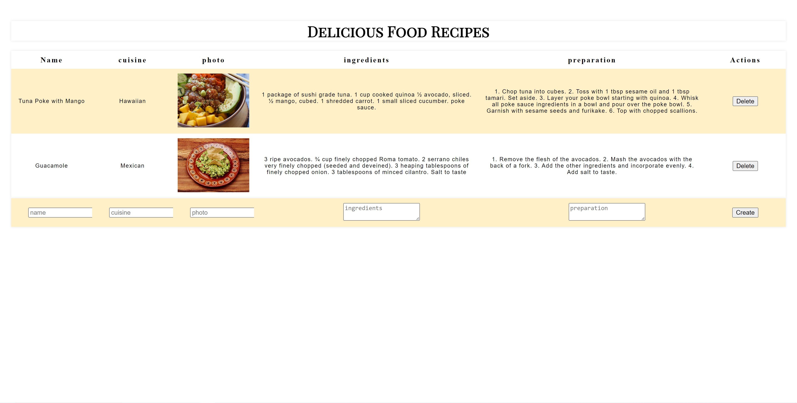

# recipe-react-app
1. First do npm install
2. npm start to start the React app
## more info about the project ##
This project follows the CRUD pattern. Users can create, read, update, delete any recipes they know.

